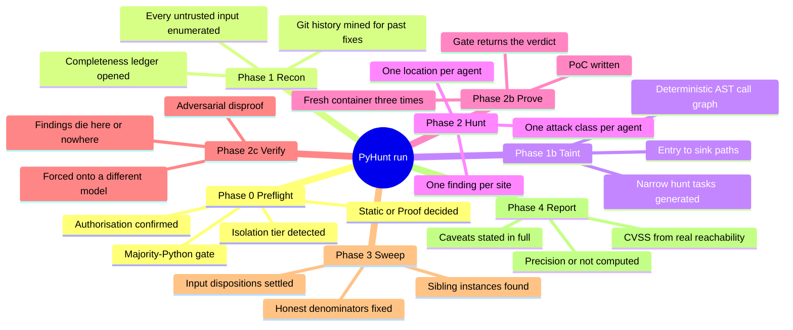
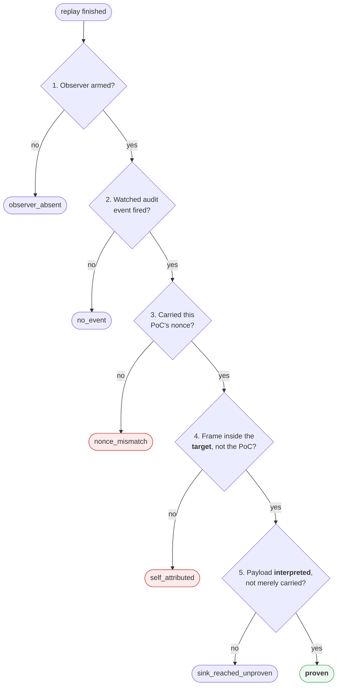
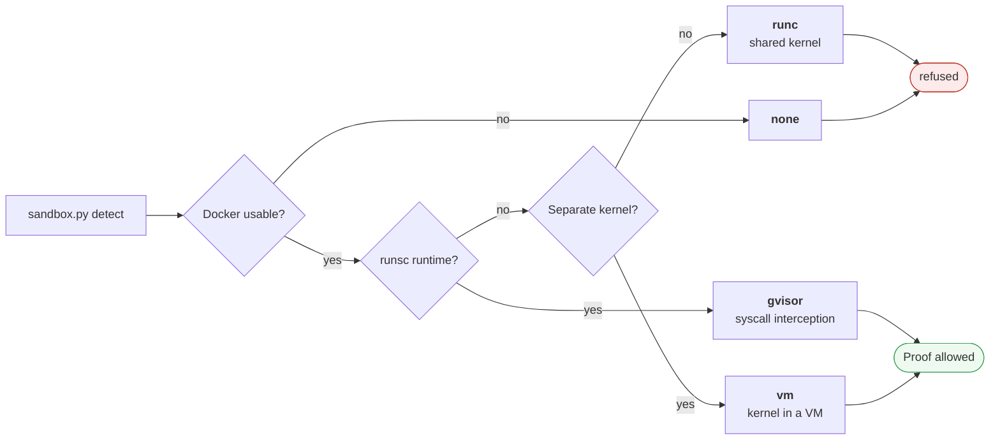

<div align="center">

# PyHunt

**A Claude Code skill that finds exploitable defects in Python repositories — and settles them by running the exploit.**

[](https://github.com/0xsharz/pyhunt/actions/workflows/ci.yml)
[](LICENSE)
[](pyproject.toml)
[](#requirements)

[Installation](#installation) · [Quick start](#quick-start) · [Usage](#usage) · [Architecture](docs/ARCHITECTURE.md) · [Comparison](#how-pyhunt-compares)

</div>

---

## Overview

Most AI security tools end with an argument. PyHunt ends with a verdict.

It hunts exploitable defects in Python repositories and, where the sandbox
allows it, settles each candidate by **running the exploit inside a disposable
container** — with the proven/unproven decision computed by a Python predicate
rather than asserted by the agent that wrote the exploit.

There is no `pyhunt` binary. The orchestrator is
[`pyhunt/SKILL.md`](pyhunt/SKILL.md), the methodology lives in
[`pyhunt/phases/`](pyhunt/phases/) as markdown the skill reads and executes, and
the Python in [`pyhunt/scripts/`](pyhunt/scripts/) is a set of helpers the skill
shells out to.

```mermaid
flowchart LR
    OP["Operator"] -->|"/pyhunt &lt;target&gt;"| CC["Claude Code"]
    CC --> SK["The skill<br/><i>SKILL.md + phases/</i>"]
    SK --> AN["Static analysis<br/><i>call graph, taint, recon</i>"]
    AN --> HU["Hunt agents<br/><i>one class, one location</i>"]
    HU --> PO["Proof-of-concept"]
    PO --> CT["Fresh container ×3<br/><i>separate kernel</i>"]
    CT --> GA["Deterministic gate<br/><i>five conditions</i>"]
    GA --> RE["report.json<br/>report.md"]

    style GA fill:#eefaf0,stroke:#3fa15c
    style CT fill:#fff3e6,stroke:#e08c2e
```



### Design principles

| | |
|---|---|
| **The author never grades the work** | The hunt agent's transcript is not evidence. A separate script re-runs the PoC in containers the agent never touched. |
| **Refuse rather than degrade** | No verified isolation means Proof mode is refused, not silently downgraded into a report full of "we looked and found nothing". |
| **Only promotion, never demotion** | A failed PoC is a fact about the PoC. Findings die in adversarial review, which reads code and argues — never in the execution path. |
| **Honest denominators** | Every enumerated input reaches a disposition. `uncovered` is a number in the report, not a silence. |

---

## Table of contents

- [How PyHunt compares](#how-pyhunt-compares)
- [Requirements](#requirements)
- [Installation](#installation)
- [Quick start](#quick-start)
- [Usage](#usage)
- [The run](#the-run)
- [What "proven" means](#what-proven-means)
- [Isolation tiers](#isolation-tiers)
- [Output](#output)
- [What PyHunt does not claim](#what-pyhunt-does-not-claim)
- [Repository layout](#repository-layout)
- [Continuous integration](#continuous-integration)
- [Contributing](#contributing)
- [Authorised use only](#authorised-use-only)
- [Licence](#licence)

---

## How PyHunt compares

PyHunt is not the first agentic security tool, and it borrows from the ones
below — see [NOTICE](NOTICE) for the attribution chain. The distinction it
draws is narrow and specific: **it is the only one of these that runs a
candidate exploit and computes the verdict outside the model.**

| Capability | **PyHunt** | [VulnHunter](https://github.com/capitalone/VulnHunter)<br/><sub>Capital One</sub> | [claude-code-<br/>security-review](https://github.com/anthropics/claude-code-security-review)<br/><sub>Anthropic</sub> | [vulnhuntr](https://github.com/protectai/vulnhuntr)<br/><sub>Protect AI</sub> | [OpenAnt](https://knostic.ai/openant)<br/><sub>Knostic</sub> |
|---|:---:|:---:|:---:|:---:|:---:|
| **Executes a candidate exploit** | ✅ | ❌ | ❌ | ❌ | ❌ |
| **Verdict computed outside the model** | ✅ | ❌ | ❌ | ❌ | ❌ |
| **Fresh container per attempt, 3 unanimous runs** | ✅ | ❌ | ❌ | ❌ | ❌ |
| **Refuses to run without VM/gVisor isolation** | ✅ | n/a | n/a | n/a | n/a |
| **Runtime observation via PEP-578 audit hooks** | ✅ | ❌ | ❌ | ❌ | ❌ |
| Adversarial falsification of its own findings | ✅ | ✅ | ❌ | ❌ | ✅ |
| Falsification forced onto a different model | ✅ | ❌ | ❌ | ❌ | ❌ |
| Entry-point-forward reasoning | ✅ | ✅ | ❌ | ✅ | ✅ |
| Deterministic AST call graph | ✅ | ✅ | ❌ | ✅ | ❌ |
| Completeness ledger with honest denominators | ✅ | ❌ | ❌ | ❌ | ❌ |
| Whole-repository scan | ✅ | ✅ | ❌ | ✅ | ✅ |
| Pull-request / diff review | ❌ | ❌ | ✅ | ❌ | ❌ |
| Generates and verifies fixes | ❌ | ✅ | ❌ | ❌ | ❌ |
| Languages beyond Python | ❌ | ✅ | ✅ | ✅ | ✅ |
| Runs unattended in CI | ❌ | ❌ | ✅ | ✅ | ✅ |

<sub>Read against the projects themselves rather than their marketing.
VulnHunter's verifier is documented as running with "**no Bash execution, no
network access**"; OpenAnt's Stage 2 is LLM attacker-persona simulation rather
than runtime execution; Anthropic's action reviews diffs inside a GitHub
workflow. `n/a` marks rows that cannot apply because the tool never executes
anything.</sub>

**Read the trade honestly.** PyHunt is Python-only, generates no fixes, and
cannot run unattended — three columns where the alternatives are simply better.
It buys one thing with those losses: when it says `proven`, a container observed
the target's own frame interpret the payload, three times over.

---

## Requirements

| | Minimum |
|---|---|
| **Claude Code** | any recent version — PyHunt is a skill, not a standalone program |
| **Python** | 3.11+ for the skill's scripts. Your system `python3` may be older; the installer builds its own virtualenv and hands over to it. |
| **Disk** | ~50 MB for the skill and its two runtime dependencies |
| **Container runtime** | only for Proof mode — see below |

### Platform support

Static mode runs anywhere Claude Code runs, with no container runtime at all.
Proof mode additionally needs an isolation tier of `vm` or `gvisor`.

| Platform | Install path | Runtime for Proof mode | Tier reached |
|---|---|---|---|
| **Linux** | `./install.sh` | gVisor `runsc` | `gvisor` |
| **Linux** | `./install.sh` | Docker Desktop for Linux *(runs its own VM)* | `vm` |
| **Linux** | `./install.sh` | plain Docker / `runc` only | **refused** — Static only |
| **macOS** | `./install.sh` | Docker Desktop, Colima, Lima or Rancher Desktop | `vm` |
| **Windows** | `./install.sh` inside **WSL2** | Docker Desktop with the WSL2 backend | `vm` |

The tier is never inferred from your operating system. `sandbox.py` asks
`docker info` and decides from the answer — `OperatingSystem: Docker Desktop`
appears on Linux, macOS and Windows alike, and a Linux daemon reported to a
`darwin` or `windows` client proves something is interposed. Check yours:

```bash
python3 pyhunt/scripts/sandbox.py detect
```

> [!NOTE]
> Verified directly on macOS (`vm`) and on Linux in CI. The Windows/WSL2 path
> follows from the same `docker info` checks and from the installer being
> ordinary bash, but it has not been exercised on Windows hardware here. Native
> PowerShell without WSL2 is **not** supported: the installer is a bash script
> and the bundled virtualenv uses POSIX layout.

---

## Installation

```bash
git clone https://github.com/0xsharz/pyhunt.git
cd pyhunt
./install.sh
```

<details>
<summary><b>Windows (WSL2)</b></summary>

PyHunt installs into the Linux side of WSL, and Claude Code must run there too.

```bash
wsl                                   # from PowerShell
sudo apt update && sudo apt install -y python3 python3-venv git
git clone https://github.com/0xsharz/pyhunt.git
cd pyhunt
./install.sh
```

For Proof mode, enable **Settings → Resources → WSL integration** in Docker
Desktop so `docker` resolves inside the distro, then confirm the tier:

```bash
python3 pyhunt/scripts/sandbox.py detect     # expect "tier": "vm"
```
</details>

<details>
<summary><b>What the installer does</b></summary>

1. Copies the skill to `~/.claude/skills/pyhunt`.
2. Builds a bundled virtualenv for its two runtime dependencies
   (`jsonschema`, `pyyaml`).
3. Smoke-tests that virtualenv through the skill's own
   `scripts/_bootstrap.py`, using the same `python3` Claude Code will invoke —
   so an install cannot report success and then fail on the first scan.
4. Installs `NOTICE`, `LICENSE` and `licenses/` beside `SKILL.md`.

It never clobbers silently: an existing directory that is not recognisably a
PyHunt install stops the script instead of being overwritten.
</details>

<details>
<summary><b>Upgrading and flags</b></summary>

Re-running `./install.sh` after a `git pull` is the supported upgrade path. A
healthy virtualenv survives the upgrade rather than being re-downloaded.

| Flag | Effect |
|---|---|
| `--rebuild-venv` | force a fresh virtualenv |
| `--no-venv` | skip the virtualenv; use the ambient interpreter |
| `--force` | replace whatever is at the destination |
| `--help` | full list |
</details>

---

## Quick start

```bash
# 1. install the skill
./install.sh

# 2. optional: see what isolation this machine can offer
python3 pyhunt/scripts/sandbox.py detect

# 3. in Claude Code:
/pyhunt ~/code/my-project
```

PyHunt confirms you are authorised to assess the target, checks it is majority
Python, reports the isolation tier it detected, and asks which mode to run.
Results land in `<target>_PYHUNT_RESULTS_<timestamp>/` beside the target.

---

## Usage

### Modes

| | **Static** *(default)* | **Proof** |
|---|---|---|
| Executes target code | never | yes, inside the sandbox |
| Requires | nothing | verified tier of `vm` or `gvisor` |
| Strongest verdict reachable | `not_attempted` | `proven` |
| Typical use | any repository, any machine | a repository you are actively assessing |

If the sandbox fails verification, **Proof mode is refused, not downgraded.** A
silent downgrade produces a report full of `not_attempted` that reads like a
report full of "we looked and found nothing".

### Resuming

Every phase records itself in `manifest.json` as it completes. Re-invoking
`/pyhunt` against an existing results directory resumes at the first phase the
manifest does not list — a disconnect costs one phase, not one run.

### Direct script use

The scripts exist to be driven by the skill, but two are useful on their own:

```bash
python3 pyhunt/scripts/sandbox.py detect        # isolation tier, with reasons
python3 pyhunt/scripts/sandbox.py up --help     # provision a target image
```

---

## The run



Phase 2b is where the design earns its keep. `scripts/replay.py` writes the PoC
into a fresh container built from the unmodified provisioned image, arms the
observer itself, captures the output itself, and runs it three times. **Three
unanimous runs or no promotion.**

📐 **[Full architecture, with a diagram per phase →](docs/ARCHITECTURE.md)**

---

## What "proven" means

Five conditions, all checked in Python by
[`pyhunt/scripts/oracle/`](pyhunt/scripts/oracle/):



Condition 5 exists because an end-to-end test caught the gate promoting a
*defended* sink:

```python
subprocess.run("echo " + name, shell=True)   # ('/bin/sh', ['-c', 'echo hi; touch …'])  → proven
subprocess.run(["echo", name])               # ('/bin/echo', ['echo', 'hi; touch …'])   → not proven
```

Both spawn a process from the target's own frame with the payload sitting in
argv. Only the first parsed it as a command. A gate without condition 5
launders a working defence into "confirmed by execution", which is worse than
having no gate at all.

Every PoC run produces exactly one of eight outcomes — `proven`,
`sink_reached_unproven`, `self_attributed`, `nonce_mismatch`, `no_event`,
`observer_absent`, `not_attempted`, `not_applicable`. **Only `proven` promotes a
finding, and nothing demotes one.**

---

## Isolation tiers



| Tier | Condition | Boundary | Proof mode |
|---|---|---|---|
| `gvisor` | Linux with `runsc` | syscall interception | allowed |
| `vm` | Docker Desktop / Lima / Colima / Rancher / WSL2 | separate kernel in a VM | allowed |
| `runc` | Linux, plain containers | namespaces only, shared kernel | **refused** |
| `none` | no usable Docker | — | refused; Static only |

`runc` is refused even though it is "a container": namespaces share the host
kernel with code you have just concluded is exploitable. The achieved tier is
recorded in the manifest and restated in the report, so a `vm` scan can never
claim `gvisor`.

On a machine without `runsc`, `detect` says so precisely rather than reporting a
failure:

> gVisor is a Linux syscall interceptor and is not available here; that is a
> missing runtime, NOT missing isolation — the VM's separate kernel is a
> stronger boundary than same-kernel interception

---

## Output

```
<target>_PYHUNT_RESULTS_<timestamp>/
├── manifest.json          phases completed, tier, mode
├── preflight.json         capability report
├── inputs.json            every untrusted input, with an id
├── tasks.json             the hunt queue
├── task_outcomes.json     append-only: findings | clean, per task
├── findings/<id>.json     one file per finding
├── verify/<id>.json       adversarial verdict + the model that ran
├── coverage.json          dispositions and denominators
├── logs/                  history mining, replay output
├── report.json            schema-validated
└── report.md              the advisory
```

---

## What PyHunt does not claim

- **An unproven finding is not a refuted finding.** Seven of the eight outcomes
  are statements about the PoC, the environment or the harness. Only `proven` is
  a statement about the code.
- **Signed observer markers are not a security boundary.** The observer signs
  each marker with a per-run HMAC key and writes it to a private file
  descriptor, and the hook scrubs that key from `os.environ` before target code
  runs — so a forged line parses to zero events. But target and hook share an
  interpreter, so a target written specifically to attack PyHunt can still
  recover the key from process memory. This defeats opportunistic forgery and
  forces any attack to be deliberate and PyHunt-specific. Out-of-process
  observation is the real fix and is out of scope.
- **Model diversity is an instruction, not a pin.** Phase 2c must run on a
  different model than phase 2. Claude Code picks the model, so this is a rule
  plus an audit trail — `verify/<id>.json` records the model that actually ran,
  making a same-model verification visible after the fact rather than
  impossible.
- **Coverage is reported, not assumed.** Every enumerated input carries a
  disposition, and `uncovered` is a number in the report.
- **No comparative performance claim is made.** PyHunt has not been benchmarked
  against Semgrep, CodeQL or Bandit, so nothing here says it finds more. The
  comparison table above is about *mechanism*, not measured yield.

---

## Repository layout

```
install.sh  NOTICE  LICENSE  licenses/     installed together
pyhunt/                                    THE SKILL — installed as /pyhunt
├── SKILL.md                               the orchestrator
├── phases/*.md                            the methodology, executed by the skill
├── references/                            execution gate, python sinks,
│                                          output contracts, honest reporting
├── schemas/*.json                         every phase output is validated
├── scripts/                               Python. Called, never in charge.
│   ├── _bootstrap.py                      resolves the bundled venv
│   ├── sandbox.py  preflight.py           tier detect | up | verify | down
│   ├── provision/                         fingerprint → Dockerfile → build
│   ├── taint.py  graph/  tasks.py         call graph, entry→sink chunking
│   ├── replay.py                          fresh container, PoC only, ×3
│   ├── oracle/                            the gate: nonce, markers, verdict
│   ├── observers/pyhunt_audit_hook.py     the PEP-578 observer
│   ├── coverage.py  fingerprint.py        dispositions, finding identity
│   └── cvss.py  redact.py  reporting/     the advisory
└── .venv/                                 bundled deps, built by install.sh
pyhunt-fix/                                remediation phases — planned, not wired
docs/ARCHITECTURE.md                       diagrams, phase by phase
```

The development material — test suite, build plan, benchmark harness and sample
corpus — is kept out of the published tree. What ships is what an operator
installs.

---

## Continuous integration

[`.github/workflows/ci.yml`](.github/workflows/ci.yml) verifies the product on
every push: it byte-compiles every script, installs the skill on Python
3.11, 3.12 and 3.13, asserts the skill and its attribution landed where Claude
Code will look for them, runs the installed `sandbox.py detect`, and re-runs the
installer to prove the upgrade path is idempotent.

An installer that only works on a clean machine is not an upgrade path, so that
last step is asserted rather than assumed.

---

## Contributing

Issues and pull requests are welcome. Two rules matter more than the rest,
because the whole tool rests on them:

1. **Nothing may weaken the gate silently.** A change to
   `pyhunt/scripts/oracle/` needs to say, in the pull request, which of the five
   proof conditions it touches and why the change cannot promote a defended
   sink.
2. **Claims in documentation must be demonstrable by a command.** If the README
   says PyHunt does something, there should be a way for a reader to watch it
   happen.

---

## Authorised use only

> [!WARNING]
> PyHunt is dual-use. Point it only at code you own or are explicitly authorised
> to assess — a scan of someone else's repository is not made acceptable by
> being read-only.

Proof mode **executes proof-of-concept exploits**. It runs them inside a
verified sandbox and refuses to run them anywhere else. There is no
`--target-url` and there will not be: aiming this at a live host turns a
validator into an attack tool.

---

## Licence

MIT — see [LICENSE](LICENSE). PyHunt derives from Apache-2.0 and MIT work;
[NOTICE](NOTICE) carries the per-component attribution and
[licenses/](licenses/) the full texts.
