# PyHunt Architecture

How PyHunt is put together, phase by phase, and where each artefact comes from.
Every diagram on this page renders natively on GitHub.

For what the tool *is* and how to run it, start with the
[README](../README.md).

---

## Contents

- [1. System overview](#1-system-overview)
- [2. The two halves: agent and oracle](#2-the-two-halves-agent-and-oracle)
- [3. The pipeline end to end](#3-the-pipeline-end-to-end)
- [4. Phase by phase](#4-phase-by-phase)
- [5. The proof path in detail](#5-the-proof-path-in-detail)
- [6. The gate: five conditions, eight outcomes](#6-the-gate-five-conditions-eight-outcomes)
- [7. Contract A: how a marker is trusted](#7-contract-a-how-a-marker-is-trusted)
- [8. Isolation tiers](#8-isolation-tiers)
- [9. Artefacts on disk](#9-artefacts-on-disk)
- [10. Trust boundaries](#10-trust-boundaries)

---

## 1. System overview

PyHunt has no daemon, no server and no `pyhunt` binary. It is a directory of
markdown that Claude Code executes, plus Python that Claude Code shells out to.

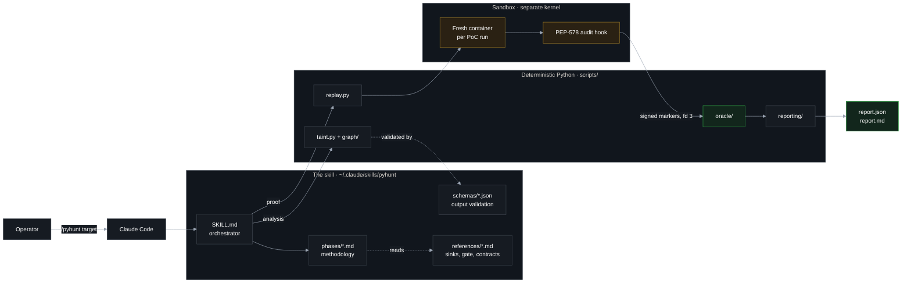

The split is the whole design. Markdown decides *what to look at*; Python
decides *what counts as proof*.

---

## 2. The two halves: agent and oracle

An agent that writes an exploit is not allowed to grade it. That is the single
structural rule the rest of the system is built to enforce.

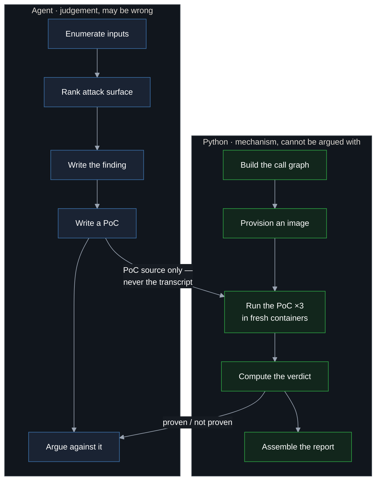

The hunt agent's transcript is never read as evidence. `replay.py` takes the
PoC *source*, arms the observer itself, captures the output itself, and runs it
three times in containers the agent never touched.

---

## 3. The pipeline end to end

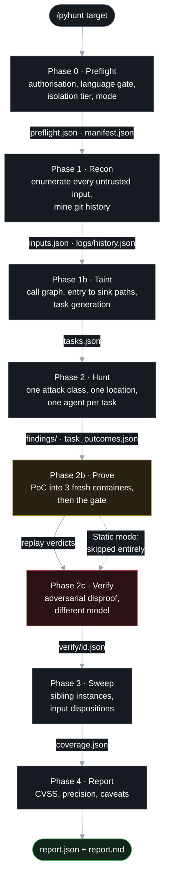

Each phase writes its output to the results directory and records itself in
`manifest.json`. Re-invoking `/pyhunt` on an existing results directory resumes
at the first phase the manifest does not list.

---

## 4. Phase by phase

### Phase 0 — Preflight

Refuses early rather than degrading quietly.

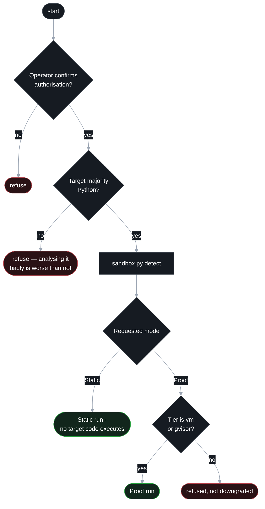

A silent downgrade would fill the report with `not_attempted`, which reads like
"we looked and found nothing". So it is refused instead.

### Phase 1 — Recon

Two independent sources of attack surface, deliberately not merged early.

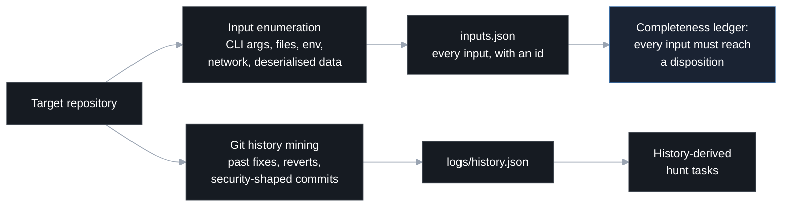

The ledger is why coverage can be reported honestly later: an input that reaches
no finding and no task scope becomes `uncovered`, and `uncovered` is a number in
the report rather than a silence.

### Phase 1b — Taint

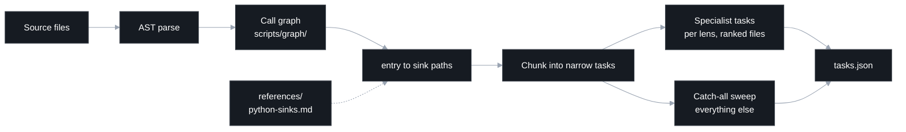

Specialist lenses each get a *relevance-ranked* file list, not the same
alphabetical slice: the codegen lens leads with templates, the IaC lens with
workflow YAML.

### Phase 2 — Hunt

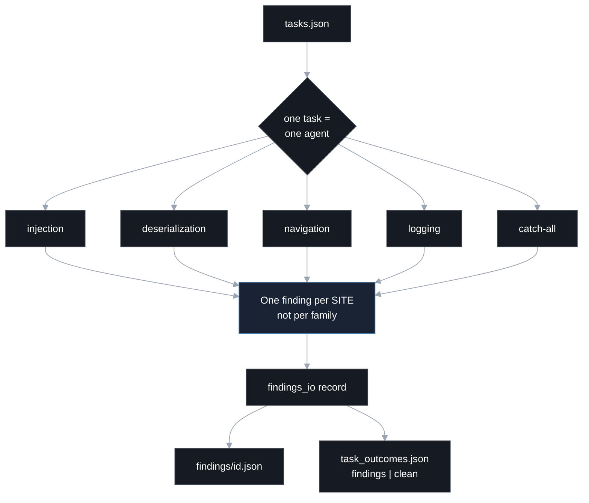

`task_outcomes.json` is what makes "hunted and clean" distinguishable from
"never hunted" — without it, coverage can never legitimately be complete.

### Phase 2b — Prove

Detailed in [section 5](#5-the-proof-path-in-detail).

### Phase 2c — Verify

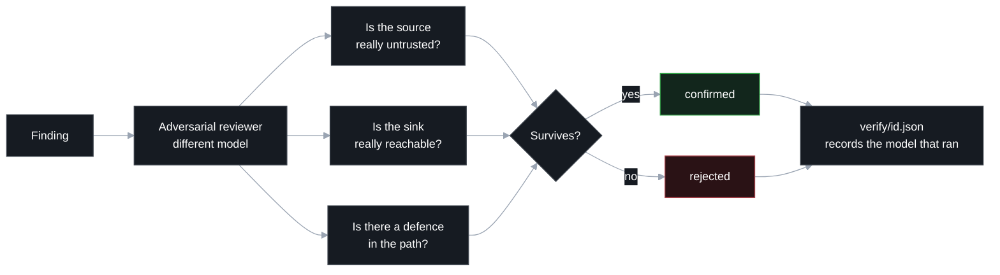

**Findings die here, never in the execution path.** A PoC that fails is a fact
about the PoC. Only an argument about the code can remove a finding.

### Phase 3 — Sweep

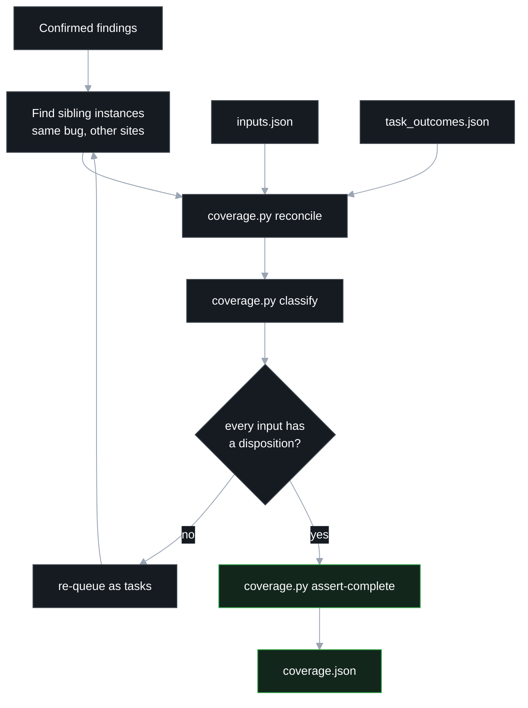

### Phase 4 — Report

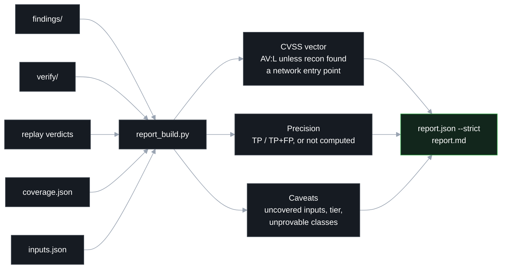

Nothing is inferred upward. A finding no one judged is not a rejected finding,
and precision says `not computed` rather than `0.0%`.

---

## 5. The proof path in detail

This is where the design earns its keep.

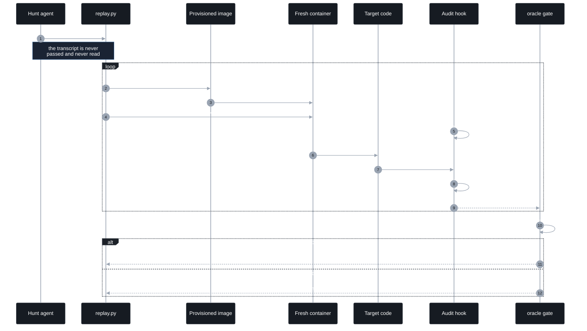

Three unanimous runs or no promotion. One run is an anecdote; three fresh
containers rule out a container that happened to be dirty.

---

## 6. The gate: five conditions, eight outcomes

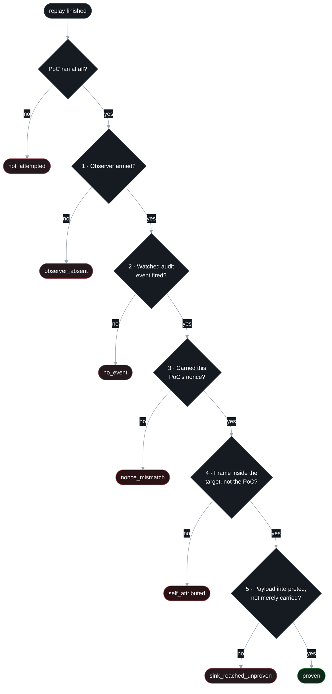

An eighth outcome, `not_applicable`, covers classes this observer structurally
cannot witness — code generated for *later* execution, for instance, where
nothing runs inside the observed process.

**Only `proven` promotes a finding, and nothing demotes one.**

Condition 5 exists because a test caught the gate promoting a *defended* sink:

```python
subprocess.run("echo " + name, shell=True)   # ('/bin/sh', ['-c', 'echo hi; touch …'])  → proven
subprocess.run(["echo", name])               # ('/bin/echo', ['echo', 'hi; touch …'])   → not proven
```

Both spawn a process from the target's own frame with the payload sitting in
argv. Only the first parsed it as a command. A gate without condition 5 launders
a working defence into "confirmed by execution", which is worse than having no
gate at all.

---

## 7. Contract A: how a marker is trusted

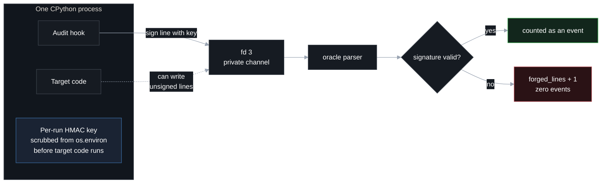

The **signature** is the control, not the secrecy of the nonce or of fd 3. The
PoC source embeds the nonce and the target can write to fd 3 — neither matters,
because an unsigned line parses to nothing.

The honest limit: target and hook share an interpreter, so a target written
specifically to attack PyHunt can still recover the key from process memory.
This defeats opportunistic forgery and forces any attack to be deliberate and
PyHunt-specific. Out-of-process observation is the real fix and is out of scope.

---

## 8. Isolation tiers

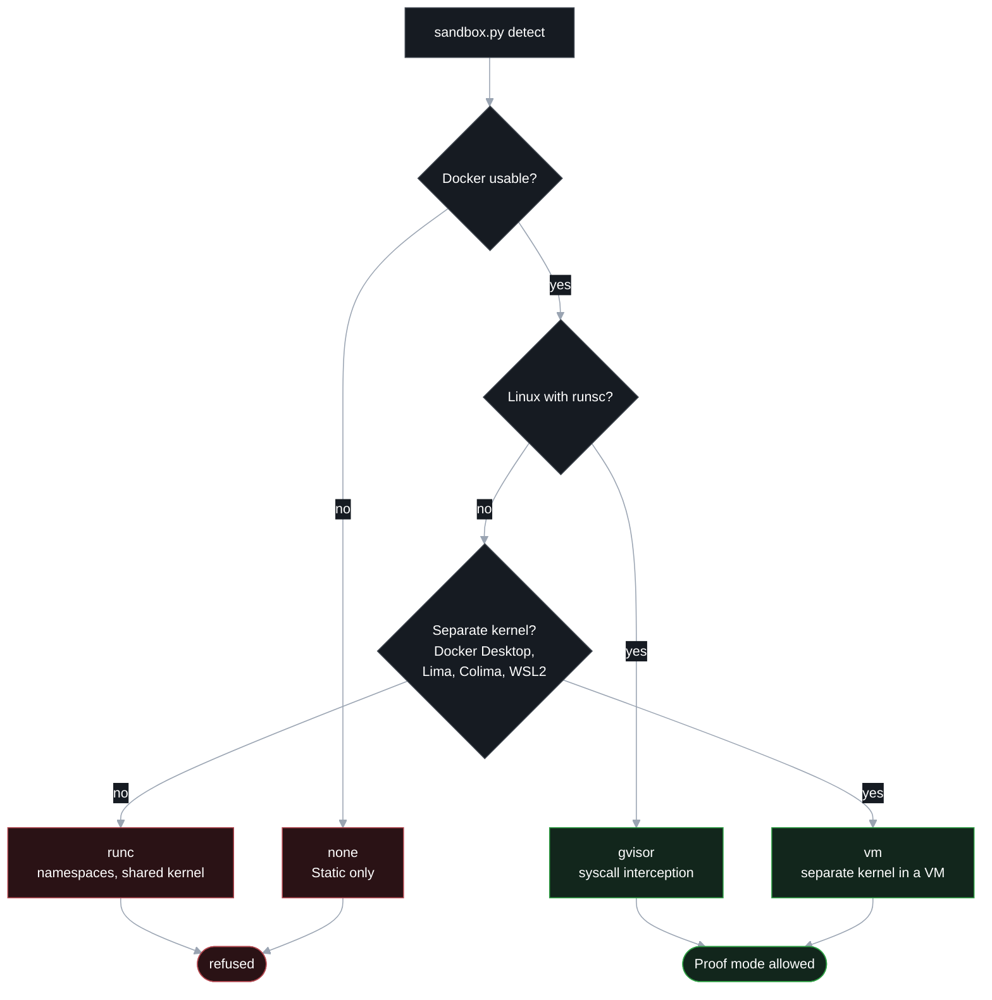

`runc` is refused even though it is "a container": namespaces share the host
kernel with code you have just concluded is exploitable. The achieved tier is
recorded in the manifest and restated in the report, so a `vm` scan can never
claim `gvisor`.

---

## 9. Artefacts on disk

```mermaid
%%{init: {"theme":"base","themeVariables":{"background":"#0d1117","primaryColor":"#161b22","primaryTextColor":"#ffffff","primaryBorderColor":"#3d444d","lineColor":"#9aa4b2","secondaryColor":"#1c2128","tertiaryColor":"#21262d","mainBkg":"#161b22","textColor":"#ffffff","nodeTextColor":"#ffffff","edgeLabelBackground":"#161b22","fontSize":"14px"}}}%%
flowchart TD
    R["target_PYHUNT_RESULTS_timestamp/"]
    R --> M["manifest.json<br/>phases completed, tier, mode"]
    R --> PF["preflight.json"]
    R --> IJ["inputs.json"]
    R --> TJ["tasks.json"]
    R --> TO["task_outcomes.json<br/>append-only"]
    R --> FD["findings/id.json"]
    R --> VD["verify/id.json"]
    R --> CJ["coverage.json"]
    R --> LG["logs/<br/>history.json, replay output"]
    R --> RJ["report.json<br/>schema-validated"]
    R --> RM["report.md<br/>the advisory"]

    classDef base fill:#161b22,stroke:#3d444d,color:#ffffff
    classDef key fill:#1a2333,stroke:#3b6ea5,color:#ffffff
    classDef good fill:#12261c,stroke:#2ea043,color:#ffffff
    class M,PF,IJ,TJ,TO,FD,VD,CJ,LG,RJ base
    class R key
    class RM good
```

Every one of these is written as its phase completes, so a disconnect costs one
phase, not one run.

---

## 10. Trust boundaries

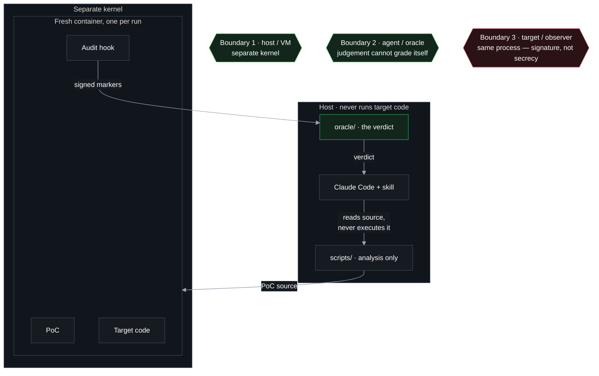

Boundary 3 is the weakest and is documented as such. Boundaries 1 and 2 are
structural; boundary 3 raises the cost of an attack without eliminating it.

---

## Further reading

| Document | What it holds |
|---|---|
| [`README.md`](../README.md) | What PyHunt is, install, usage, comparison |
| [`pyhunt/SKILL.md`](../pyhunt/SKILL.md) | The orchestrator Claude Code actually executes |
| [`pyhunt/phases/`](../pyhunt/phases/) | The methodology, one file per phase |
| [`pyhunt/references/execution-gate.md`](../pyhunt/references/execution-gate.md) | The gate specified in prose |
| [`pyhunt/references/python-sinks.md`](../pyhunt/references/python-sinks.md) | The sink catalogue |
| [`pyhunt/references/honest-reporting.md`](../pyhunt/references/honest-reporting.md) | What may and may not be claimed |
| [`pyhunt/references/output-contracts.md`](../pyhunt/references/output-contracts.md) | The shape every phase must emit |
